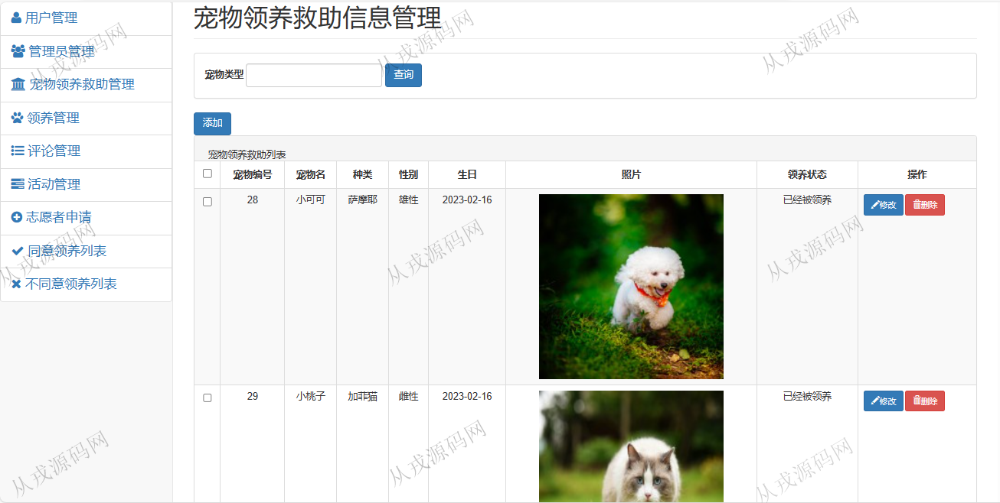

<h1 align="center">215.宠物领养救助管理系统</h1>

- <b>完整代码获取地址：从戎源码网 ([https://armycodes.com/](https://armycodes.com/))</b>
- <b>技术探讨、资料分享，请加QQ群：692619798</b> 
- <b>作者微信：19941326836  QQ：952045282</b> 
- <b>承接计算机毕业设计、Java毕业设计、Python毕业设计、深度学习、机器学习</b>
- <b>选题+开题报告+任务书+程序定制+安装调试+论文+答辩ppt 一条龙服务</b>
- <b>所有选题地址 ([https://github.com/YuLin-Coder/AllProjectCatalog](https://github.com/YuLin-Coder/AllProjectCatalog)) </b>

## 项目介绍
基于javaweb的宠物领养救助管理系统：前端 jsp、jquery，后端 maven、springmvc、spring、mybatis；角色分为管理员、用户；集成领养中心、流浪猫狗知识、流浪猫狗管理等功能于一体的系统。

## 功能介绍

### 用户

- 基本功能：登录，注册，退出
- 网站首页：主导航栏，轮播图，流浪猫狗展示
- 流浪猫狗知识：猫和狗的健康和关怀、猫和狗的美容、猫和狗的食物、猫和狗的行为
- 领养中心：猫狗列表，详情，在线领养
- 团队：团队展示，团队活动展示

### 管理员

- 用户信息：用户信息的增删改查，也可以由用户在前端自行注册
- 管理员信息：管理员信息的增删改查
- 流浪猫狗管理：流浪狗猫信息的增删改查，图片上传
- 领养管理：用户领养信息查询，审核
- 评论管理：查询用户的评论信息，对评论信息进行修改和删除操作

## 环境

- <b>IntelliJ IDEA 2021.3</b>

- <b>Mysql 5.7.26</b>

- <b>Tomcat 7.0.73</b>

- <b>JDK 1.8</b>

## 运行截图

